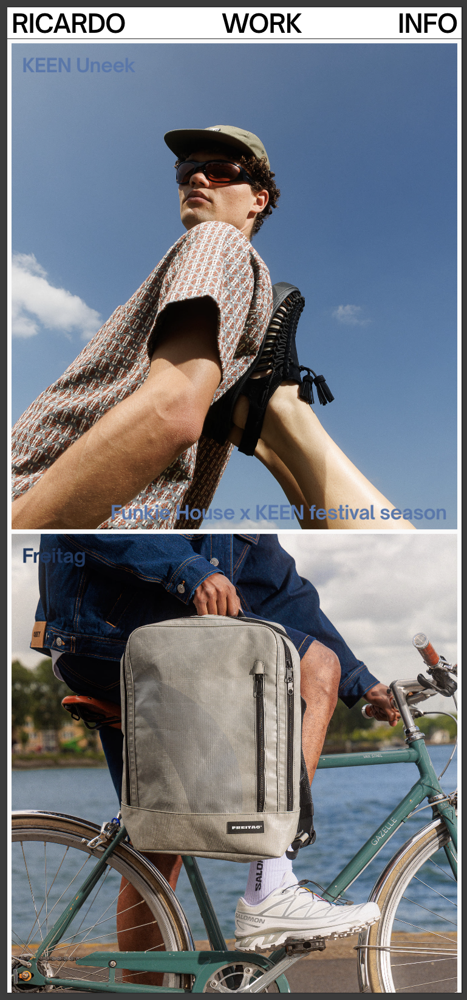
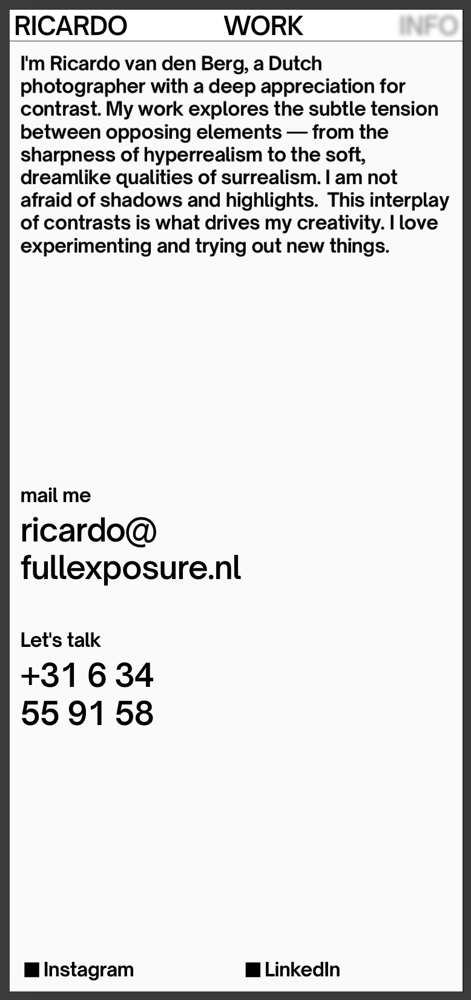
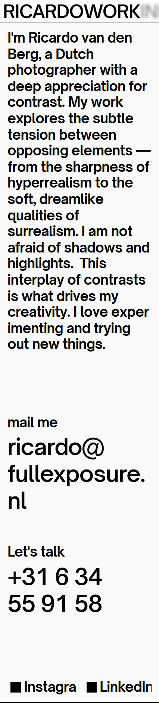

# Procesverslag
Markdown is een simpele manier om HTML te schrijven.  
Markdown cheat cheet: [Hulp bij het schrijven van Markdown](https://github.com/adam-p/markdown-here/wiki/Markdown-Cheatsheet).

Nb. De standaardstructuur en de spartaanse opmaak van de README.md zijn helemaal prima. Het gaat om de inhoud van je procesverslag. Besteedt de tijd voor pracht en praal aan je website.

Nb. Door *open* toe te voegen aan een *details* element kun je deze standaard open zetten. Fijn om dat steeds voor de relevante stuk(ken) te doen.

## Jij

  
uitwerken voor kick-off werkgroep

  ### Auteur:
  Tom Stevens

  #### Je startniveau:
  Rood

  #### Je focus:
  responsiveness
 

## Je website

  
uitwerken voor kick-off werkgroep

Bij de kick-off (de eerste les na de vakantie) liepen we eerst door het programma dat we dit blok gaan volgen en keken we naar wat dit vak inhoudt en welke opdracht we gaan maken.
Om weer in het schrijven van css te komen, begonnen we met een aantal oefeningen die voor mij vrij makkelijk waren, maar naarmate je verder kwam moest je dingen gebruiken zoals hover en dat was wel een beetje weggezakt. Het was daarom fijn om dat weer even onder de knie te krijgen.

  ### Je opdracht:
  https://www.fullexposure.nl/

  #### Screenshot(s) van de eerste pagina (small screen): 
  Full-Exposure work pagina
 
  

  #### Screenshot(s) van de tweede pagina (small screen):
  Full-Exposure info pagina:
 
  
 

## Toegankelijkheidstest 1/2 (week 1)

  
uitwerken na test in 2e werkgroep

Voordat ik de toegangelijkheidstest ging doen moest ik eerst een aantal oefeningen doen van apple toen ik de voice-over setting aan probeerde te zetten. Om de voice-over optie te gebruiken moet je alle shortcuts kunnen gebruiken om het internet, in dit geval mijn gekozen website, te navigeren. In het begin was ik erg gefrustreerd dat de stem, die mij moest helpen bij het navigeren, behoorlijk irritant was en ik hoofdpijn kreeg. Na een tijdje begon ik het een beetje te begrijpen en kon, op een soort van normaal tempo, de website navigeren. Alleen had ik mijn ogen open en kon zien hoe de website eruit zag en wat ik moest doen om door te kunnen gaan. Het is lastig om dan jezelf voor te stellen dat je helemaal tot bijna niks kan zien en dan ook nog is al die shortcutes moet kunnen te gebruiken. Voor deze opdracht moesten we samen met degene naast je, in mijn geval was dat chantelle die de europese funko pop website had gekozen, samen met die persoon moest je bij elkaars website kijken of de gekozen website makkelijk of moeilijk te navigeren was met de voice-over functie. Op de gekozen website van haar was hij goed te navigeren.  

  ### Bevindingen
  Lijst met je bevindingen die in de test naar voren kwamen:
 
      - Je website semantisch correct maken zodat mensen die slecht zien zijn de voice-over functie kunnen gebruiken zonder dat ze tegen obstakels aan lopen zoals dat de kopjes niet goed zijn aangeroepen.
 
      - Hoe moeilijk het is om een website te kunnen navigeren tijdens dat je amper tot niks kan zien en dan ook nog shortcuts moeten leren te gebruiken.
 
      - Dat de website die ik heb gekozen nog niet helemaal optimaal is voor mensen die de voice-over functie gebruiken.

## Breakdownschets (week 1)

  
uitwerken na afloop 3e werkgroep

  ### de hele pagina: 
  

  ### dynamisch deel (bijv menu): 
  
Hier kun je zien dat, tijdens het klein maken, het menu niet veranderd in een hamburger menu, maar een misvormde in één geklapte niet bestaand woord.

   
  

  ### wellicht nog een dynamisch deel (bijv filter), maar in dit geval ik die aan een tramhokje hang: 
  

## Voortgang 1 (week 2)

  
uitwerken voor 1e voortgang

  ### Stand van zaken
  hier dit ging goed & dit was lastig (neem ook screenshots op van delen van je website en code)

  ### Agenda voor meeting
  samen met je groepje opstellen

  | student 1      | student 2          | student 3    | student 4        |
  | ---            | ---                | ---          | ---              |
  | dit bespreken  | en dit             | en ik dit    | en dan ik dat    |
  | en dat ook nog | dit als er tijd is | nog een punt | dit wil ik zeker |
  | ...            | ...                | ...          | ...              |

  ### Verslag van meeting
  hier na afloop snel de uitkomsten van de meeting vastleggen

  - punt 1
  - punt 2
  - nog een punt
  - ...

## Voortgang 2 (week 3)

  
uitwerken voor 2e voortgang

  ### Stand van zaken
  hier dit ging goed & dit was lastig (neem ook screenshots op van delen van je website en code)

  ### Agenda voor meeting
  samen met je groepje opstellen

  | student 1      | student 2          | student 3    | student 4        |
  | ---            | ---                | ---          | ---              |
  | dit bespreken  | en dit             | en ik dit    | en dan ik dat    |
  | en dat ook nog | dit als er tijd is | nog een punt | dit wil ik zeker |
  | ...            | ...                | ...          | ...              |

  ### Verslag van meeting
  hier na afloop snel de uitkomsten van de meeting vastleggen

  - punt 1
  - punt 2
  - nog een punt
- ...

## Toegankelijkheidstest 2/2 (week 4)

  
uitwerken na test in 9e werkgroep

  ### Bevindingen
  Lijst met je bevindingen die in de test naar voren kwamen (geef ook aan wat er verbeterd is):

## Voortgang 3 (week 4)

  
uitwerken voor 3e voortgang

  ### Stand van zaken
  hier dit ging goed & dit was lastig (neem ook screenshots op van delen van je website en code)

  ### Agenda voor meeting
  samen met je groepje opstellen

  | student 1      | student 2          | student 3    | student 4        |
  | ---            | ---                | ---          | ---              |
  | dit bespreken  | en dit             | en ik dit    | en dan ik dat    |
  | en dat ook nog | dit als er tijd is | nog een punt | dit wil ik zeker |
  | ...            | ...                | ...          | ...              |

  ### Verslag van meeting
  hier na afloop snel de uitkomsten van de meeting vastleggen

  - punt 1
  - punt 2
  - nog een punt
  - ...

## Eindgesprek (week 5)

  
uitwerken voor eindgesprek

  ### Je uitkomst - karakteristiek screenshots:
  

  ### Dit ging goed/Heb ik geleerd: 
  Korte omschrijving met plaatjes

  

  ### Dit was lastig/Is niet gelukt:
  Korte omschrijving met plaatjes

  

## Bronnenlijst

  
continu bijhouden terwijl je werkt

  Nb. Wees specifiek ('css-tricks' als bron is bijv. niet specifiek genoeg). 
  Nb. ChatGpT en andere AI horen er ook bij.
  Nb. Vermeld de bronnen ook in je code.

  1. bron 1
  2. bron 2
  3. ...

