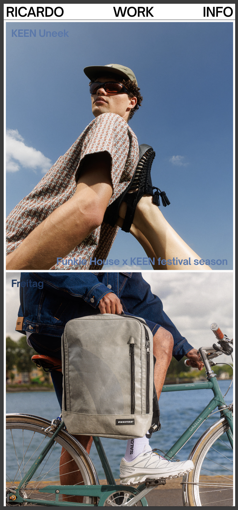

# Procesverslag
Markdown is een simpele manier om HTML te schrijven.  
Markdown cheat cheet: [Hulp bij het schrijven van Markdown](https://github.com/adam-p/markdown-here/wiki/Markdown-Cheatsheet).

Nb. De standaardstructuur en de spartaanse opmaak van de README.md zijn helemaal prima. Het gaat om de inhoud van je procesverslag. Besteedt de tijd voor pracht en praal aan je website.

Nb. Door *open* toe te voegen aan een *details* element kun je deze standaard open zetten. Fijn om dat steeds voor de relevante stuk(ken) te doen.

## Jij

  
uitwerken voor kick-off werkgroep

  ### Auteur:
  Tom Stevens

  #### Je startniveau:
  Rood

  #### Je focus:
  responsiveness
 

## Je website

  
uitwerken voor kick-off werkgroep

Bij de kick-off (de eerste les na de vakantie) liepen we eerst door het programma dat we dit blok gaan volgen en keken we naar wat dit vak inhoudt en welke opdracht we gaan maken.
Om weer in het schrijven van css te komen, begonnen we met een aantal oefeningen die voor mij vrij makkelijk waren, maar naarmate je verder kwam moest je dingen gebruiken zoals hover en dat was wel een beetje weggezakt. Het was daarom fijn om dat weer even onder de knie te krijgen.

  ### Je opdracht:
  https://www.fullexposure.nl/

  #### Screenshot(s) van de eerste pagina (small screen): 
  Full-Exposure work pagina
 
  

  #### Screenshot(s) van de tweede pagina (small screen):
  Full-Exposure info pagina:
 
  
 

## Toegankelijkheidstest 1/2 (week 1)

  
uitwerken na test in 2e werkgroep

Voordat ik de toegangelijkheidstest ging doen moest ik eerst een aantal oefeningen doen van apple toen ik de voice-over setting aan probeerde te zetten. Om de voice-over optie te gebruiken moet je alle shortcuts kunnen gebruiken om het internet, in dit geval mijn gekozen website, te navigeren. In het begin was ik erg gefrustreerd dat de stem, die mij moest helpen bij het navigeren, behoorlijk irritant was en ik hoofdpijn kreeg. Na een tijdje begon ik het een beetje te begrijpen en kon, op een soort van normaal tempo, de website navigeren. Alleen had ik mijn ogen open en kon zien hoe de website eruit zag en wat ik moest doen om door te kunnen gaan. Het is lastig om dan jezelf voor te stellen dat je helemaal tot bijna niks kan zien en dan ook nog is al die shortcutes moet kunnen te gebruiken. Voor deze opdracht moesten we samen met degene naast je, in mijn geval was dat chantelle die de europese funko pop website had gekozen, samen met die persoon moest je bij elkaars website kijken of de gekozen website makkelijk of moeilijk te navigeren was met de voice-over functie. Op de gekozen website van haar was hij goed te navigeren.  

  ### Bevindingen
  Lijst met je bevindingen die in de test naar voren kwamen:
 
      - Je website semantisch correct maken zodat mensen die slecht zien zijn de voice-over functie kunnen gebruiken zonder dat ze tegen obstakels aan lopen zoals dat de kopjes niet goed zijn aangeroepen.
 
      - Hoe moeilijk het is om een website te kunnen navigeren tijdens dat je amper tot niks kan zien en dan ook nog shortcuts moeten leren te gebruiken.
 
      - Dat de website die ik heb gekozen nog niet helemaal optimaal is voor mensen die de voice-over functie gebruiken.

## Breakdownschets (week 1)

  
uitwerken na afloop 3e werkgroep

  ### de hele pagina: 
  

  ### dynamisch deel (bijv menu): 
  
Hier kun je zien dat, tijdens het klein maken, het menu niet veranderd in een hamburger menu, maar een misvormde in één geklapte niet bestaand woord.

   
  

## Voortgang 1 (week 2)

  
uitwerken voor 1e voortgang

  ### Stand van zaken
  Tijdens dit eerste voortgangs gesprek was ik nog niet echt toegekomen met het begin van het na maken (beter maken) van mijn gekozen website. Des ondanks had ik wel een vraag over hoe "display: grid;" werkte.
  Voordat ik aan de beurt was ging ik nog even opnieuw kijken bij de opdrachten die we hadden gehad om te oefenen met display:grid; en toen opeens klikte het. Ik was helemaal vergeten dat je eerst een template moest maken   om vervolgens de items die je erin wil zetten het juiste cijfer/vakje als eigenschap te geven.

  ### Agenda voor meeting
  samen met je groepje opstellen

  Voor het gesprek hadden we een teams chat gemaakt om daarin ons voor te bereiden. Helaas reageerde niet iedereen met een vraag die hij/zij had voor u.

  
 Mel: had nog niet echt iets waar ze tegen aanliep aangezien ze nog wat achter liep. 
 
  
 Rodin: (niet gereageerd) 
 
  
Gulav: Had net zoals ik nog moeite met het begrijpen van display: grid;.
 
  
Fatima: Had nog vragen over de html structurerende elementen en welke ze in een bepaalde situatie moest gebruiken.
 
  
Ik(Tom): IK had nog moeite met het begrijpen van display: grid;
 

  ### Verslag van meeting
  Na het voortgangs gesprek was mijn vraag (niet echt helaas) beantwoord. Voordat ik het kon vragen begreep ik het opeens.
  Voor de rest wou ik alleen even laten zien wat ik wou gaan doen als verbeter punten aan de website die ik na ging maken.

  - responsiveness was niet goed als het scherm klein werd.
  - header/nav had geen gap meer als het scherm klein werd.

## Voortgang 2 (week 3)

  
uitwerken voor 2e voortgang

  ### Mini-symposium

  <strong>Tijdens het mini-symposium kwamen er 3 mensen praten over toegankelijkheid van websites en ook voorbeelden uit de praktijk.</strong>
   
   
  Wettelijke verplichtingen: De eerste persoon die kwam spreken had het over wettelijke verplichtingen waaraan websites moeten voldoen om voor zo veel mogelijk mensen toegankelijk te zijn. Ik was helaas te laat gekomen      aangezien mijn tram 2x uitviel, dus een groot deel van deze spreker heb ik gemist. Waar ik wel nog bij was is dat er online eens in de zoveel jaar online vergaderingen zijn die je kan bijwonen om te praten over de         regels van toegankelijkheid. Wat er ook nog was gezegd is doordat bijvoorbeeld amsterdam een hele toegankelijke website heeft er een soort competitie ontstaat met andere gemeentes die zelf de meest toegankelijke website 
  willen hebben. Hier door gaan gemeente steeds verder in op toegankelijkheid.
   
   
  Eigen ervaring: Een mevrouw die les geeft aan de hogeschool van Rotterdam kwam praten over het leven met een beperking. Ze is doof en heeft daardoor op veel manieren problemen mee door slecht geregelde dingen die
  eigenlijk heel makkelijk opgelost kunnen worden. Een aantal dingen die werden benoemt waren: Gebeld worden door het appartementen complex tijdens dat ze al jaren lang heeft gezegd dat ze doof is en dus niet gebeld kan
  worden, de ns (spreekt voorzich), dat ze nog nooit een nederlandse film heeft gezien en geen nederlandse tv kijkt. Voor veel of wel bijna allemaal zijn er al meerdere oplossingen in andere landen, maar nederland loopt
  hier mee heel erg achter. De ondertiteling van tv uitzendingen zijn zo traag en slecht dat je niet eens kan begrijpen wat er allemaal gezegd wordt, tijdens dat in het buitenland dit al helemaal geen probleem meer is.
  Ook was nog een probleem dat als je een afspraak maakt online je al snel alleen je telefoonnummer kan invoeren als bereik middel. Er zijn een aantal bedrijven die het zo hebben gemaakt dat als je met de klantenservice
  wil praten maar je bent doof dat je dan, inplaats van dat je naar de persoon aan de andere kant van de lijn moet luisteren, een chat ziet waar je kan lezen wat er wordt gezegd aan de andere kant van de lijn.
   
   
  Toegankelijkheid in websites: Een oudstudent van het cmd die nu bij Q42 werkt kwam praten over hoe je je website toegankelijk kan maken. Hij ging vooral praten over de website waar hij met een groepje mee bezig is en
  hoe hij het maken van een toegankelijk maar wel vette visual website mogelijk maakt. De website waar hij over ging praten was Oculi Mundi. Buiten hele mooie visual gemaakt met css kan je ook de motion restricten voor
  mensen die zee ziek worden door alle beweging. Alles wordt dan aangepast en word minder bewegend.

  ### Stand van zaken
  Voor dit voortgangsgesprek liep ik nog behoorlijk achter aangezien ik was begonnen met een pagina na maken die ik eigenlijk helemaal niet eens wou doen. 
  De pagina had een carousel met images erin die automatisch van rechts naar links gingen en dat vond ik zo leuk dat ik die er ook maar lekker bij ging doen.
  Achteraf was dat niet een hele tactische keuze aangezien ik niet al te veel tijd nog had om de andere 2 te maken omdat ik toevallig ook nog is achterliep bij het vak vormgeving.

  ### Agenda voor meeting
  Helemaal niemand reageerde in de teams (rodin en die andere meid waarvan ik steeds de naam vergeet). Volgens mij hadden gulav en mel wel vragen maar die van mel waren hetzelfde als die van mij.
  Ze wou namelijk ook gewoon feedback op wat we tot dan toe hadden gemaakt en of we nog aanpassingen moesten doen./

  Gulav: had geen vragen
  Mel: wou feedback op haar tot dan toe nagemaakte website
  Tom (ik lol haha.......): Ik wou ook feedback op wat ik had gemaakt.

  ### Verslag van meeting
  De punten die eruit kwamen waren (tromgeroffel):
  - Er is geen h1
  - Sommige headings aanpassen

  naast dit was er niet echt iets waarover ik vragen kon stellen aangezien, zoals ik als zei, ik achterliep.

## Toegankelijkheidstest 2/2 (week 4)

  
uitwerken na test in 9e werkgroep

  ### Bevindingen
  Lijst met je bevindingen die in de test naar voren kwamen (geef ook aan wat er verbeterd is):
  De dingen die ik verbeterd heb:
    - dark- en lightmode toegevoegd
    - highcontrast mode werkt
    - Dat kleur niet de enige manier is waarop informatie overkomt aan de gebruiker.
    - De tekst die over iets staan (bijvoorbeeld rood) dat die niet wit is, dus beter contrast.
    - De forms zijn duidelijk aangegeven wat je uhh ik weet niet wat ik moet zeggen behalve dat het duidelijk is wat je moet plaatsen in de form denk ik.
    - De viewport is niet disabled
    - De focus state is duidelijk
    - Bij de scaling van breed naar dus dat het een clean process is dus niet dat er random tussen door white space aan 1 kant ontstaat.
    - alle images hebben een alt. 

  De dingen die tegen vielen:
    - alleen de work page gaat niet tot 280px scallen dus dat is jammer.
    - Ik kan de carousel niet met reduced motion uitzetten en je kan het ook niet op pauze zetten.
    - Er zijn 2 h1's in de nav omdat ik niet echt een oplossing kon vinden aangezien de ene weg gaat als het scherm kleiner wordt dat 810px,
      dus ik dacht dat dat niet erg zou zijn aangezien de ene of de ander altijd uit staat.
    - Ik heb geen skiplinks want ik snapte er helemaal niks van en ik had nog maar 2 uurtjes waarin ik niet helemaal wild zou gaan.

## Voortgang 3 (week 4)

  
uitwerken voor 3e voortgang

  ### Stand van zaken
  Tijdens dit gesprek was ik bezign met de work pagina en de hover effect op de afbeelding zetten, wat best wel lastig was aangezien het als een soort
  reverse hover werkt dus je moet conten="" gebruiken en dan ::after en ::before zodat je de hover kan laten zien voordat je hovert en dat de opacity 0 wordt als je wel hovert, ja.

  ### Agenda voor meeting
  Tijdens dit gesprek had ik niet echt veel vragen. Ik wou meer vragen wat ik kon doen om mijn website iets beter te maken zoals light en dark mode intergreren erin zodat dat werkt.
  Daarnaast zei u (niet jij student assistent) dat ik nog een form erin moest zetten waardoor mijn hoop dat ik niet te veel tijd hoefte te spenderen weg ging. 
  Helaas zei helemaal niemand iets in de groep op teams dus kan ik niet echt iets hier onderzetten. Ik was daar en tegen ook nog is te laat voor het gesprek,
  omdat de tram 2x uitviel en ik op een of andere manier de metro had gemist tijdens dat ik er recht voor stond :).

  ### Verslag van meeting
  hier na afloop snel de uitkomsten van de meeting vastleggen

  - Ik heb nog geen formulier
  - dark- en lightmode moet ook nog.

  Beetje weinig helaas maar ik wist wel dat het een hele taaie week zou gaan worden aangezien dit niet het enigste vak is waar ik achterloop.

## Eindgesprek (week 5)

  
uitwerken voor eindgesprek

  ### Je uitkomst - karakteristiek screenshots:
  

  ### Dit ging goed/Heb ik geleerd: 
  Korte omschrijving met plaatjes

  

  ### Dit was lastig/Is niet gelukt:
  Korte omschrijving met plaatjes

  

## Bronnenlijst

  
continu bijhouden terwijl je werkt

  Nb. Wees specifiek ('css-tricks' als bron is bijv. niet specifiek genoeg). 
  Nb. ChatGpT en andere AI horen er ook bij.
  Nb. Vermeld de bronnen ook in je code.

  1. bron 1
  2. bron 2
  3. ...

